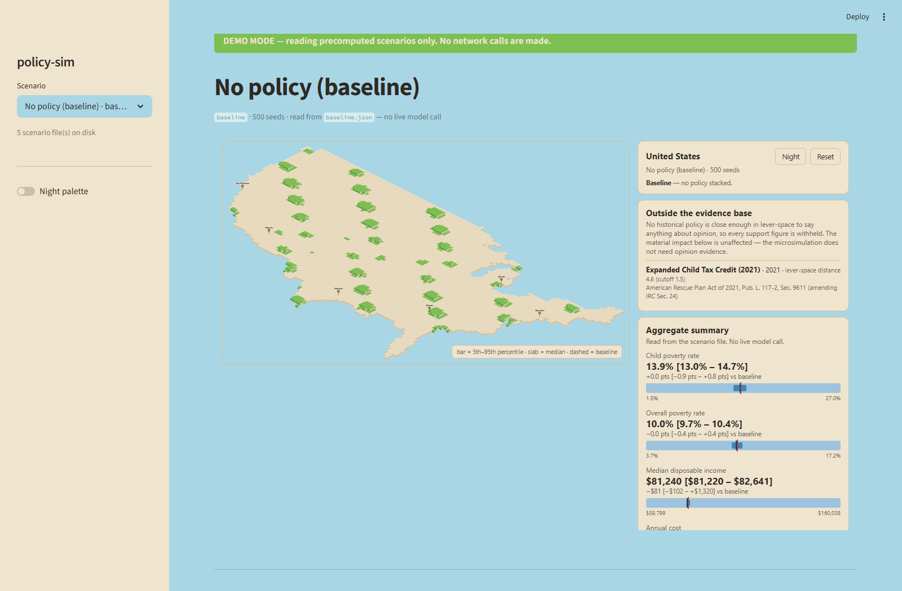

# policy-sim

Microsimulation of cash-transfer and child-tax-credit policy, with poststratified
opinion estimates and pre-registered backtests against the 2021 expanded CTC.
You describe a policy in plain English; a language model translates it into
levers and shows you its reading so you can correct it; a vectorized
microsimulation over ACS PUMS households produces every number on screen, each
one carrying the 5th–95th percentile band from a 500-seed run. Nothing is
rendered as a bare point estimate, and a verification pass checks the generated
memo against the simulation output number by number.



## The architecture rule

**LLMs parse and explain. Statistical models produce every number.**

This is enforced by construction, not by convention:

| Component | Touches a model? | Produces a number? |
|---|---|---|
| `app/parser.py` | yes — English → levers | no. `extra="forbid"` rejects any invented outcome field outright |
| `model/` | no | yes. Every figure originates here |
| `app/main.py` | no | no. Reads `scenarios/*.json` and renders it |
| `app/report.py` | yes — writes the memo | no. Every number it emits is checked back against the input |

`app/` never imports from `model/`. The demo reads precomputed JSON, so the
scripted path has no dependency on the live engine.

### The interval rule

`app/charts.py` has exactly one text formatter, `interval_text`, and it always
emits the p05–p95 band alongside the median. There is no function that renders
a point estimate. Bar widths are never normalised across charts — a metro
interval is wider than a national one because a metro subsample carries more
sampling error, and equalising the bars would hide the thing the bands exist to
show.

Where the scenario contract supplies a bare number with no band
(`pct_better_off`, `disposable_income_delta`), it is quarantined in a labelled
"no interval published" block rather than shown beside the banded figures.

### The numeric verification panel

After the memo is generated, `verify_numbers` extracts every numeric token from
the text and checks it against the simulation JSON and evidence records it was
given. Percent/fraction twins, thousands separators and B/M/K/T suffixes pass;
a derived difference, a re-rounded figure or an invented subgroup percentage
does not. Cited `evidence_id`s that do not exist are reported too.

The panel renders whether or not it finds anything — **"0 unverified numbers"
is the point**.

## Run it

```bash
python -m pip install -r requirements.txt
POLICY_SIM_DEMO_MODE=1 python -m streamlit run app/main.py
```

Then open <http://localhost:8501>.

Demo mode reads `scenarios/*.json` and makes **zero network calls** — it cannot
be broken by wifi, a rate limit or an expired key. This is the mode to present
in.

Click any of the six metro markers to zoom into that metro; the right-hand
panel switches to figures computed on that metro's own subpopulation, not
scaled down from the national ones, and says so. "National view" zooms back
out.

### The map

The outline is the U.S. Census Bureau's dissolved national boundary
(`cb_2023_us_nation_20m`), simplified to 338 points by
`model/build_us_outline.py`. City markers sit at the population-weighted
centroid of the tracts inside each metro's PUMAs, from the 2020
centers-of-population file — not coordinates typed from memory. Re-run:

```bash
python model/build_us_outline.py
```

An earlier version traced the coastline by hand at about sixty points. Tiled,
it did not read as the United States, which is the whole job of a map.

### With an API key

The scenario files need no key. The plain-English policy box and the generated
memo are the only components that reach out:

```bash
echo 'ANTHROPIC_API_KEY=sk-...' > .env
python -m streamlit run app/main.py          # note: no DEMO_MODE
```

Without a key the policy box returns a readable message rather than a
traceback, so leaving it unset is a safe way to present.

### Checks

```bash
python -m pytest app/tests -q       # 107 app tests
python app/tests/smoke_demo.py      # drives the running app in a browser
python model/diagnostics.py         # 25 engine invariants + MCMC convergence
bash model/reproduce.sh             # rebuild every artefact from raw PUMS
```

### Environment variables

| Variable | Default | Effect |
|---|---|---|
| `ANTHROPIC_API_KEY` | — | Required for the parser and the memo only |
| `POLICY_SIM_DEMO_MODE` | off | Scenario files only, no network |
| `POLICY_SIM_MODEL` | `claude-opus-5` | Model for parsing and the memo |
| `POLICY_SIM_PARSER_TIMEOUT` | `30` | Seconds before the parser falls back |
| `POLICY_SIM_REPORT_TIMEOUT` | `60` | Seconds before memo generation gives up |
| `POLICY_SIM_SCENARIO_DIR` | `scenarios/` | Where to read scenarios from (tests) |

## Tests

```bash
python -m pip install -r requirements-dev.txt
python -m pytest app/tests -q
```

107 tests. `test_frontend_js.py` needs `node` on PATH and skips without it.

## Data sources

**Population.** ACS 1-year PUMS, national household and person files, from the
[Census PUMS directory](https://www2.census.gov/programs-surveys/acs/data/pums/).
Sampled to 30,000 households with probability proportional to `WGTP`. Built by
`model/build_population.py`; validated against published ACS totals by
`model/validate_population.py`.

**Metro definitions.** OMB CBSA delineation files, via
`model/build_metro_crosswalk.py`. PUMAs are assigned to a metro by majority of
2020 population; CBSA codes are looked up by title rather than hardcoded, so an
OMB re-delineation surfaces as an error rather than a wrong assignment.

**Opinion.** Hand-curated survey crosstabs in `data/evidence.json`, each record
carrying its pollster, field dates, question wording, sample size and URL. Every
figure was read out of the primary topline or crosstab document, not a secondary
write-up:

- [The Economist/YouGov, 4–6 Aug 2024](https://d3nkl3psvxxpe9.cloudfront.net/documents/econTabReport_qdE4wzP.pdf) (N=1,618) — CTC eligibility expansion and inflation adjustment, with income-band crosstabs
- [Data for Progress, Apr–May 2021](https://filesforprogress.org/datasets/2021/5/dfp-permanent-child-tax-credit-expansion-TOPS.pdf) (N=1,189 / N=1,402) — the 2021 ARPA CTC parameterisation
- [Data for Progress / Mayors for a Guaranteed Income, Jun–Jul 2021](https://www.filesforprogress.org/memos/voters-support-a-guaranteed-income.pdf) (N=1,137) — guaranteed income
- [American Compass / YouGov, 10–13 Aug 2021](https://americancompass.org/child-tax-credit-expansion-survey/) (N=2,000) — one-year vs permanent vs unconditional expansion

### Known gaps in the evidence

Stated here because they change how the support estimates should be read:

- **No census-region crosstabs exist** in any source found. Region cells fall
  back to broader subgroups; the fallback is recorded in the scenario warnings.
- **Income bands are not quintiles.** The available breaks are
  `<50K / 50–100K / 100K+`. They are labelled `income_band`, not
  `income_quintile`, and mapping them onto quintiles is an explicit modelling
  step, not a relabelling.
- **No 2021 CTC poll with income crosstabs was found.** The only income-band
  CTC crosstabs are from 2024, which constrains what the opinion backtest can
  hold out.
- **No EITC records.** Only secondary summaries were available and they were
  not used.

## Layout

- `model/` simulation, validation, poststratification, backtests (Track A)
- `app/` streamlit demo (Track B)
- `data/raw/` downloaded ACS PUMS (gitignored)
- `data/processed/` sampled population parquet
- `data/evidence.json` hand-curated survey crosstabs (tracked)
- `scenarios/` precomputed output JSON — this is what the demo reads
- `docs/` plan, pre-registration, charts

Build plan: [docs/plan.md](docs/plan.md)
